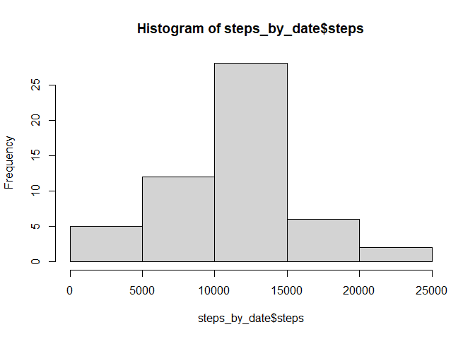
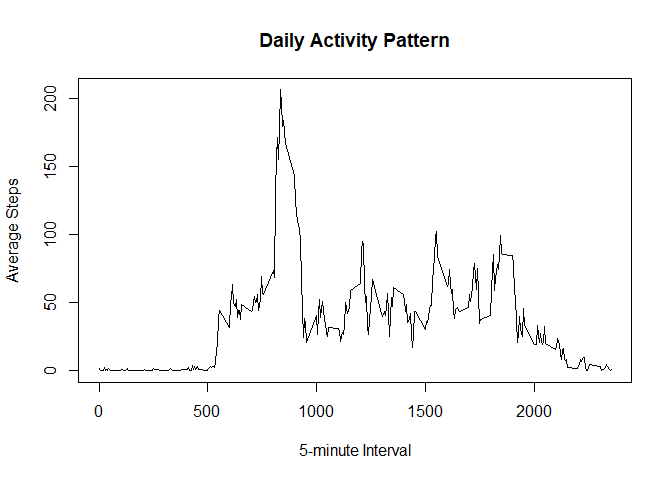
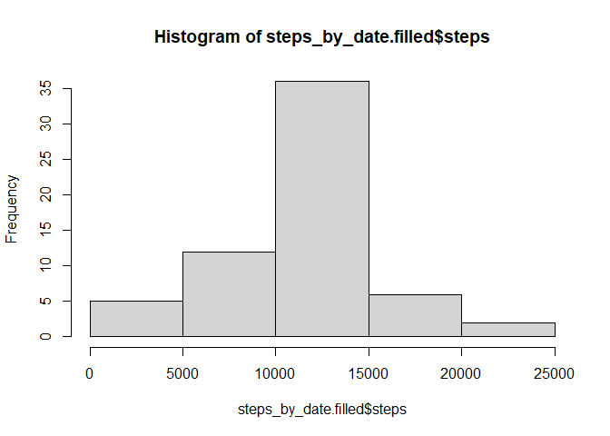
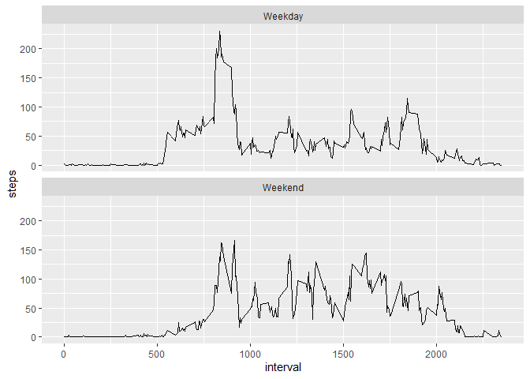

```r
library(dplyr)
```

```
## 
## Attaching package: 'dplyr'
```

```
## The following objects are masked from 'package:stats':
## 
##     filter, lag
```

```
## The following objects are masked from 'package:base':
## 
##     intersect, setdiff, setequal, union
```

```r
library(tidyr)
library(ggplot2)
```


## Loading and preprocessing the data


```r
activity.raw = read.csv('activity.csv')
```


```r
activity = mutate(activity.raw, date= as.Date(date, format= "%Y-%m-%d"))
summary(activity)
```

```
##      steps             date               interval     
##  Min.   :  0.00   Min.   :2012-10-01   Min.   :   0.0  
##  1st Qu.:  0.00   1st Qu.:2012-10-16   1st Qu.: 588.8  
##  Median :  0.00   Median :2012-10-31   Median :1177.5  
##  Mean   : 37.38   Mean   :2012-10-31   Mean   :1177.5  
##  3rd Qu.: 12.00   3rd Qu.:2012-11-15   3rd Qu.:1766.2  
##  Max.   :806.00   Max.   :2012-11-30   Max.   :2355.0  
##  NA's   :2304
```

## What is mean total number of steps taken per day?
1. make a histogram of the total number of steps taken each day.

```r
steps_by_date = activity %>%
   group_by(date) %>% summarise(
  steps = sum(steps)
)
hist(steps_by_date$steps)
```

<!-- -->

2. Calculate and report the **mean**and **median** total number of steps taken each day.

```r
avg_steps = mean(steps_by_date$steps, na.rm = TRUE)
med_steps = median(steps_by_date$steps, na.rm = TRUE)
avg_steps
```

```
## [1] 10766.19
```

```r
med_steps
```

```
## [1] 10765
```

The average total steps per day is 1.0766189\times 10^{4}, and the median is 10765 steps.

## What is the average daily activity pattern?
1. Make a time series plot of the 5-minute interval and average number of steps taken.

```r
steps_by_interval = activity %>%
   group_by(interval) %>% summarise(
  steps = mean(steps, na.rm = TRUE)
)
plot(steps_by_interval$interval, steps_by_interval$steps,type = "l",
     xlab="5-minute Interval", ylab="Average Steps", main="Daily Activity Pattern")
```

<!-- -->

2. Which 5-min interval, on average across all the days in the dataset, contains the maximum number of steps?

```r
max_int = steps_by_interval$interval[which.max(steps_by_interval$steps)]
max_int
```

```
## [1] 835
```

The 5-minute interval from 8:35 has the highest number of steps on average.

## Imputing missing values
1. Calculate and report the total number of missing values in the dataset.

```r
colSums(is.na(activity))
```

```
##    steps     date interval 
##     2304        0        0
```
The total number of rows with NAs is 2304.

2. Devise a strategy for filling in all of the missing values in the dataset. 
The strategy does not need to be sophisticated. For example, you could use the 
mean/median for that day, or the mean for that 5-minute interval, etc.

Strategy adopted: 
Group by 5-minute interval and fill na by mean of the that interval across all days.

3. Create a new dataset that is equal to the original dataset but with the missing data filled in.

```r
activity.filled <- activity %>% 
  group_by(interval) %>% 
  mutate(steps = ifelse(is.na(steps), mean(steps, na.rm = T), steps))
```

4. Make a histogram of the total number of steps taken each day and Calculate
and report the mean and median total number of steps taken per day. Do
these values differ from the estimates from the first part of the assignment?
What is the impact of imputing missing data on the estimates of the total
daily number of steps?


```r
steps_by_date.filled = activity.filled %>%
   group_by(date) %>% summarise(
  steps = sum(steps)
)
hist(steps_by_date.filled$steps)
```

<!-- -->


```r
summary(steps_by_date.filled)
```

```
##       date                steps      
##  Min.   :2012-10-01   Min.   :   41  
##  1st Qu.:2012-10-16   1st Qu.: 9819  
##  Median :2012-10-31   Median :10766  
##  Mean   :2012-10-31   Mean   :10766  
##  3rd Qu.:2012-11-15   3rd Qu.:12811  
##  Max.   :2012-11-30   Max.   :21194
```
From the summary statistics above, both mean and median are 10766 steps per day.

As compared to the initial estimates, the mean remains unchanged, while median changed.
This is caused by imputing missing data using mean value for each interval group:
It does not change the mean, but does shift the distribution of steps and hence 
changed the median.


## Are there differences in activity patterns between weekdays and weekends?
1. Create a new factor variable in the dataset with two levels – “weekday”
and “weekend” indicating whether a given date is a weekday or weekend
day.

```r
activity.filled <- activity.filled %>% 
    mutate(week.ind= ifelse(weekdays(date) %in% c("Saturday", "Sunday"), "Weekend","Weekday"))

activity.filled$week.ind <- as.factor(activity.filled$week.ind)
```

2. Make a panel plot containing a time series plot (i.e. type = "l") of the
5-minute interval (x-axis) and the average number of steps taken, averaged
across all weekday days or weekend days (y-axis). 

```r
steps_by_week_by_interval <- activity.filled %>%
   group_by(week.ind,interval) %>% summarise(
  steps = mean(steps, na.rm = TRUE)
)
```

```
## `summarise()` has grouped output by 'week.ind'. You can override using the
## `.groups` argument.
```


```r
ggplot(data = steps_by_week_by_interval) + 
    aes(x = interval, y = steps) + 
    geom_line()+
    facet_wrap(~week.ind, ncol = 1)
```

<!-- -->


